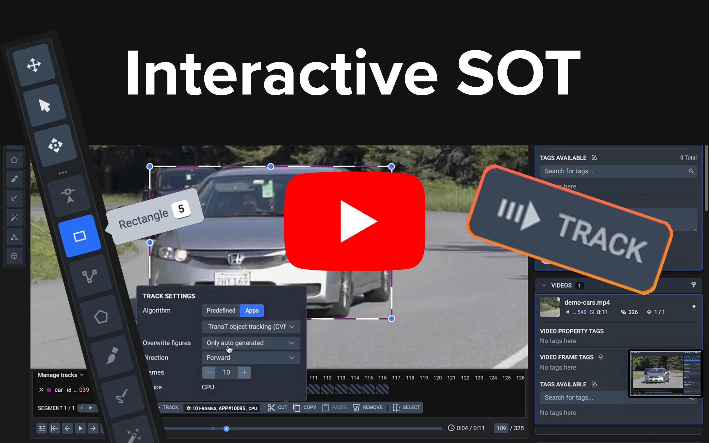
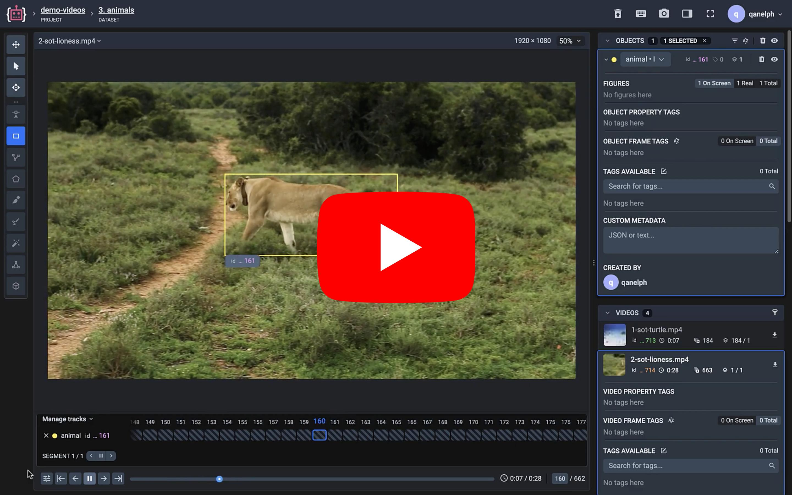

  
# TransT object tracking (CVPR2021)

state-of-the art interactive object tracking (CVPR2021) integrated into Supervisely Videos Labeling tool

---

  
  

  <a href="#Original-work">Original work</a> •
    <a href="#How-to-run">How to run</a> •
  <a href="#How-to-use">How to use</a> •
    <a href="#Controls">Controls</a> •
  <a href="#Demo">Demo</a> 

# Original work

Original work available by hyperlinks: [**paper (CVPR2021)**](https://arxiv.org/abs/2103.15436) and [**code**](https://github.com/chenxin-dlut/TransT).

## TransT architecture

TransT uses the input image to extract information about the appearance of the target and the surrounding area.  
It extracts feature maps from two patch images:

1. manually marked region of the image
2. the nearest area of the marked region

Next, feature maps are converted for use in the Feature Fusion Network, as shown in the dotted box in the Figure.  
* **ECAs — two ego-context extensions**, focus on **useful semantic context adaptively through the self-attention of multiple heads** to improve feature presentation.  
* **CFA — two cross function expansion modules**, obtain the performance maps of both their own and the other branch at the same time, and combine the two function maps through a multi-head cross-focus.  

Thus, two ECAs and two CFAs form a merge layer.  

After the Feature Fusion Network, the feature maps are fed into the predicted head, which calculates the coordinates of the object and classifies the pixels as background and foreground.

## TransT results

State-of-the-art comparison on TrackingNet, LaSOT, and GOT-10k. The best two results are shown in <b>red</b> and <b>blue</b> fonts:

<b>AUC</b> scores of different attributes on the <b>LaSOT</b> dataset:

# How to run

### ⚠️ Notice  
 * The application may already be launched by the instance administrator (**Enterprise**) or the Supervisely team (**Community**). If the app is not available in dropdown menu in Videos Labeling tool, please contact us. If the TransT responds slowly, please run additional application sessions in your team.
 * **Enterprise only**: You can share started application with all users on your instance using **share** button in front of running session. We recommend to run multiple sessions if large number of users are using TransT simultaneously.

---

1. Add [TransT object tracking (CVPR2021)](https://ecosystem.supervise.ly/apps/supervisely-ecosystem/trans-t/supervisely/serve) from Ecosystem

  

2. Run app from **Plugins & Apps** page:

3. Run app on agent with `GPU`

  

4. The model has been successfully deployed

  

5. Use in `Videos Annotator` 

  

# How to use

<table>
  <tr style="width: 100%">
    <td>
      
    </td>
    <td>
       
    </td>
  </tr>
</table>

# Controls

| Key                                                           | Description                               |
| ------------------------------------------------------------- | ------------------------------------------|
| <kbd>5</kbd>                                       | Rectangle Tool                |
| <kbd>Ctrl + Space</kbd>                                       | Complete Annotating Object                |
| <kbd>Space</kbd>                                              | Complete Annotating Figure                |
| <kbd>Shift + T</kbd>                                          | Track Selected     |
| <kbd>Shift + Enter</kbd>                                      | Play Segment     |

# Demo

We have prepared a videos and demonstrated how TransT works on the following domains:

* <a href="#People">People</a>  
* <a href="#Automobiles">Automobiles</a>  
* <a href="#Animals">Animals</a> 
* <a href="#Things">Things</a> 
* <a href="#Conveyor">Conveyor</a> 

## People

<table>
  <tr style="width: 100%">
    <td>
      
    </td>
    <td>
       
    </td>
  </tr>
  <tr>
    <td>
       
    </td>
    <td>
       
    </td>
  </tr>
  <tr>
    <td>
      
    </td>
    <td>
      
    </td>
  </tr>
</table>

## Automobiles

<table>
  <tr style="width: 100%">
    <td>
       
    </td>
    <td>
        
    </td>
  </tr>
  <tr style="width: 100%">
    <td>
       
    </td>
    <td>
        
    </td>
  </tr>
  </tr>
  <tr style="width: 100%">
    <td>
       
    </td>
  </tr>
</table>

## Animals

<table>
  <tr style="width: 100%">
    <td>
       
    </td>
    <td>
       
    </td>
  </tr>
  <tr style="width: 100%">
    <td>
       
    </td>
  </tr>
</table>

## Things

<table>
  <tr style="width: 100%">
    <td>
       
    </td>
    <td>
       
    </td>
  </tr>
  <tr style="width: 100%">
    <td>
       
    </td>
    <td>
       
    </td>
  </tr>
  <tr style="width: 100%">
    <td>
       
    </td>
    <td>
       
    </td>
  </tr>
  <tr style="width: 100%">
    <td>
       
    </td>
  </tr>
</table>

## Conveyor

<table>
  <tr style="width: 100%">
    <td>
       
    </td>
    <td>
       
    </td>
  </tr>
  <tr style="width: 100%">
    <td>
       
    </td>
    <td>
       
    </td>
  </tr>
</table>
